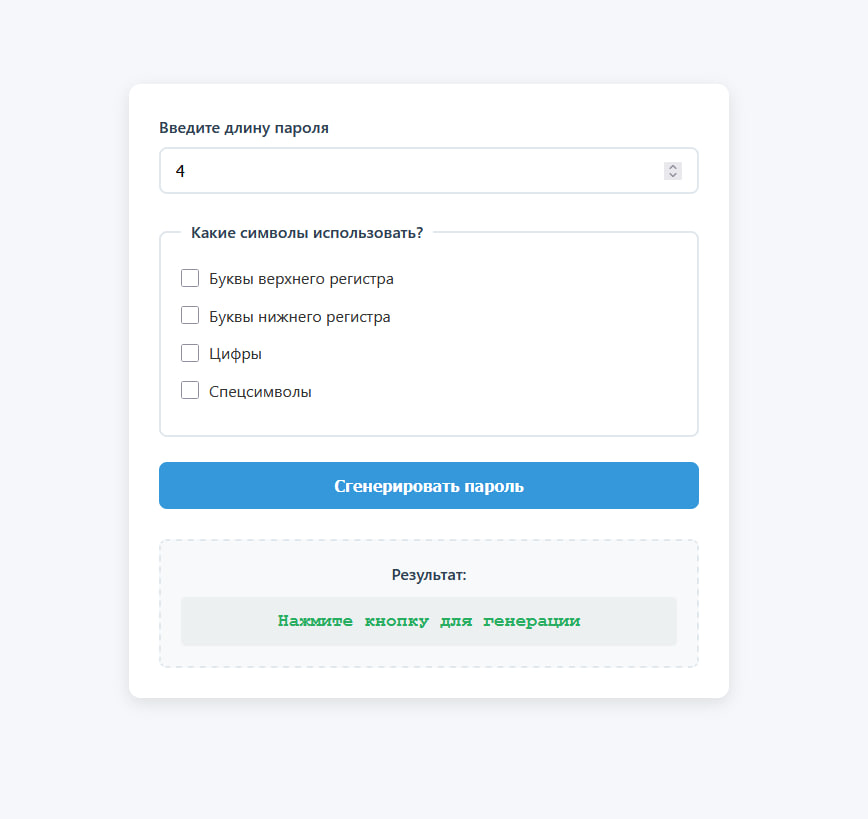
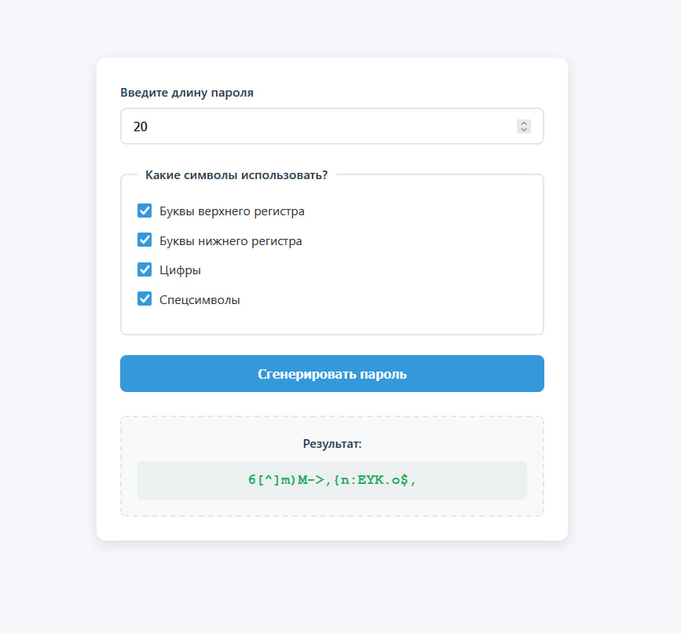

# randomPasswordGenerator

Генератор случайных паролей

Используемые технологии:

- html
- css
- БЭМ
- jQuery
- aJax
- PHP

Что нужно делать:

Пользователь вводит желаемую длину пароля и выбирает, какие символы использовать -

буквы верхнего/нижнего регистра, цифры, спецсимволы.

Скрипт генерирует случайную строку заданной длины и сложности, а затем отображает её.

Готовый функционал:

1. Валидация длины пароля (ввод от 4 до 20 символов, вводить можно только цифры)
2. Выбор категории символов (защита от пустых чекбоксов)
3. Пароль генерируется заданной длины, нужных символов

Скриншоты приложения:

